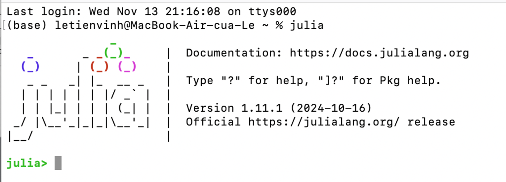
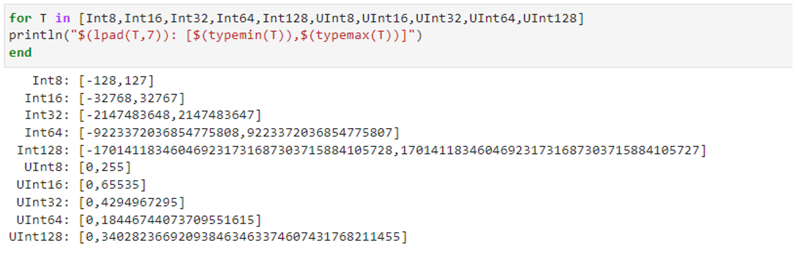
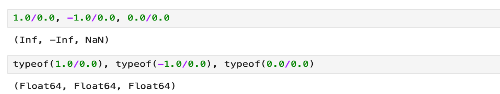
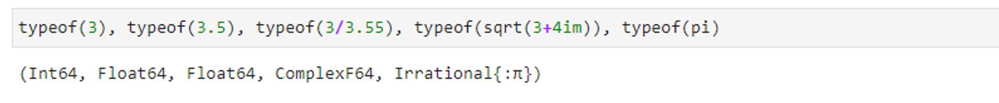
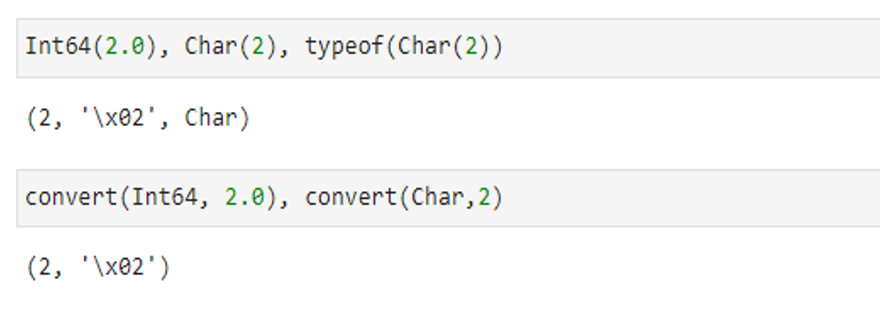
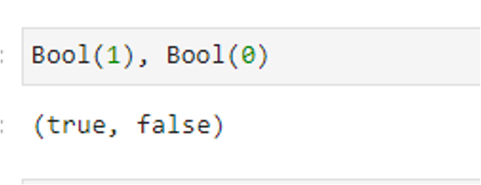
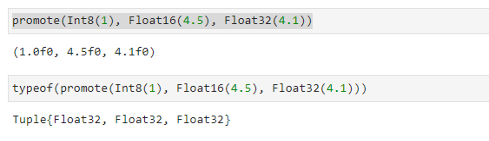
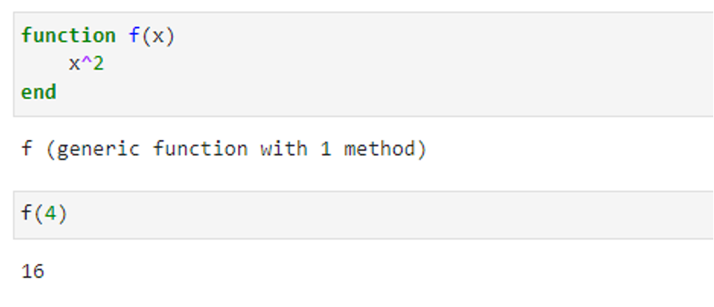
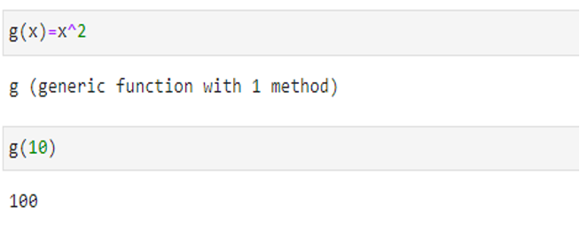
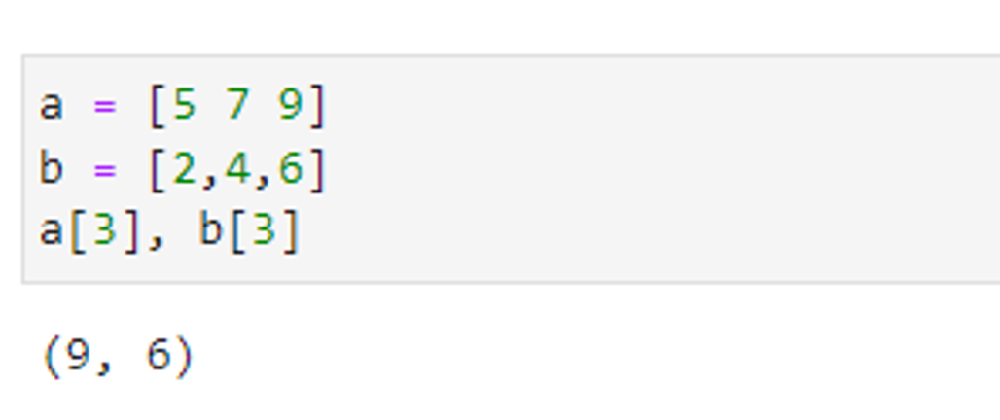

---
## Front matter
title: "Отчёт по лабораторной работе №1"
subtitle: "Компьютерный практикум по статистическому анализу данных"
author: "Ле Тиен Винь"

## Generic otions
lang: ru-RU
toc-title: "Содержание"

## Bibliography
bibliography: bib/cite.bib
csl: pandoc/csl/gost-r-7-0-5-2008-numeric.csl

## Pdf output format
toc: true # Table of contents
toc-depth: 2
lof: false # List of figures
lot: false # List of tables
fontsize: 12pt
linestretch: 1.5
papersize: a4
documentclass: scrreprt
## I18n polyglossia
polyglossia-lang:
  name: russian
  options:
	- spelling=modern
	- babelshorthands=true
polyglossia-otherlangs:
  name: english
## I18n babel
babel-lang: russian
babel-otherlangs: english
## Fonts
mainfont: PT Serif
romanfont: PT Serif
sansfont: PT Sans
monofont: PT Mono
mainfontoptions: Ligatures=TeX
romanfontoptions: Ligatures=TeX
sansfontoptions: Ligatures=TeX,Scale=MatchLowercase
monofontoptions: Scale=MatchLowercase,Scale=0.9
## Biblatex
biblatex: true
biblio-style: "gost-numeric"
biblatexoptions:
  - parentracker=true
  - backend=biber
  - hyperref=auto
  - language=auto
  - autolang=other*
  - citestyle=gost-numeric
## Pandoc-crossref LaTeX customization
figureTitle: "Рис."
tableTitle: "Таблица"
listingTitle: "Листинг"
lofTitle: "Список иллюстраций"
lotTitle: "Список таблиц"
lolTitle: "Листинги"
## Misc options
indent: true
header-includes:
  - \usepackage[T2B]{fontenc}
  - \usepackage{indentfirst}
---

# I.Цель работы

Основная цель работы — подготовить рабочее пространство и инструментарий для работы с языком программирования Julia, на простейших примерах познакомиться с основами синтаксиса Julia.

# II. Постановка задачи

I. Установите под свою операционную систему Julia, Jupyter. 
II. Используя Jupyter Lab, повторите примеры. 
III. Выполните задания для самостоятельной работы.

# III. Выполнение работы

## Пункт I
1.	После скачивания anaconda и anaconda откройте anaconda navigator и и нажмите «запустить» Jupyter Lab.

2.	Выбирайте Julia и выполните работы.

## Пункт II
1. Определял тип данных числа

2. Проверил специальные значения Inf, -Inf, NaN и определял их тип 
   

3.	Определял крайних значений диапазонов целочисленных числовых величин

4. Преобразовал типов можно реализовать или прямым указанием

5. Преобразовал 1 в булевое true, 0 — в булевое false

6. Для приведения нескольких аргументов к одному типу, если это возможно, используется оператор promote() и определял их тип

7. Определ функцию 𝑓(𝑥) возведения переменной 𝑥 в квадрат и возведём в квадрат число 4

8. Другой способ определения несложных функций

9. пределял одномерных массивов (вектор-строка и вектор-столбец) и обращение к их 3-ым элементам

## Пункт III

# Выводы

Познакомился с основами синтаксиса Julia.
s