---
## Front matter
lang: ru-RU
title: "Презентация по лабораторной работе №1."
subtitle: "Компьютерный практикум по статистическому анализу данных"
author: "Ле Тиен Винь"
institute:
  - Российский университет дружбы народов, Москва, Россия
date: 16 Сентября 2024

## i18n babel
babel-lang: russian
babel-otherlangs: english

## Formatting pdf
toc: false
toc-title: Содержание
slide_level: 2
aspectratio: 169
section-titles: true
theme: metropolis
header-includes:
 - \metroset{progressbar=frametitle,sectionpage=progressbar,numbering=fraction}
 - '\makeatletter'
 - '\beamer@ignorenonframefalse'
 - '\makeatother'
---

# Информация
:::::::::::::: {.columns align=center}
::: {.column width="70%"}
  * Ле Тиен Винь
  * студент
  * Российский университет дружбы народов
  * [1032215241@pfur.ru](mailto:1032215241@rudn.ru)
  * https://github.com/tvle2000/information
  
:::
::: {.column width="30%"}

:::
::::::::::::::

# I.Цель работы

Основная цель работы — подготовить рабочее пространство и инструментарий для работы с языком программирования Julia, на простейших примерах познакомиться с основами синтаксиса Julia.

# Подготовка инструментария к работе 

- Установим Julia (https://julialang.org/) и Jupyter (https://jupyter.org/) под вашу операционную систему.

# Задание

Основы синтаксиса Julia на примерах

1. Определим тип числовой величины.
   
2. В Julia введены специальные значения Inf, -Inf, NaN, обозначающие бесконечность и отсутствие какого-либо значения. Такие значения могут получаться в результате операций типа деления на ноль, а также могут быть допустимой частью выражений, поскольку в языке имеют тип вещественного числа.
   
3. Для определения крайних значений диапазонов целочисленных числовых величин можно воспользоваться следующим кодом:

# Выполнения работы

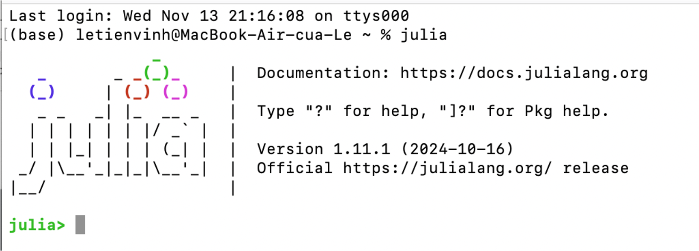

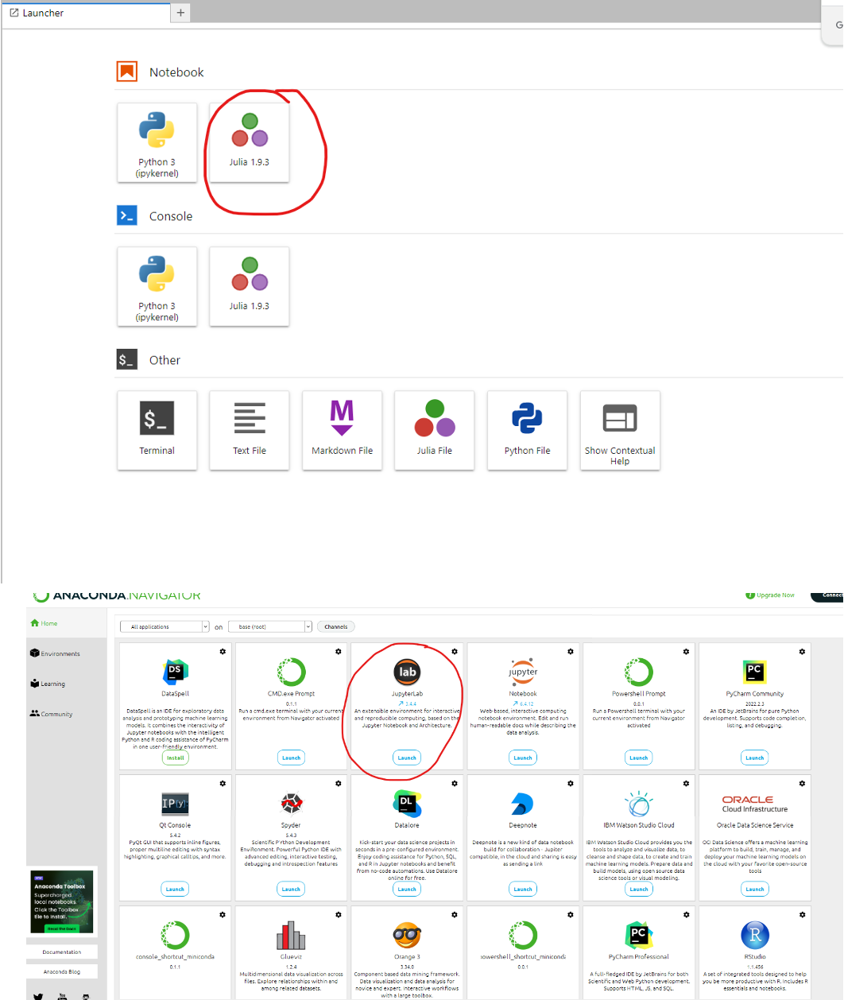

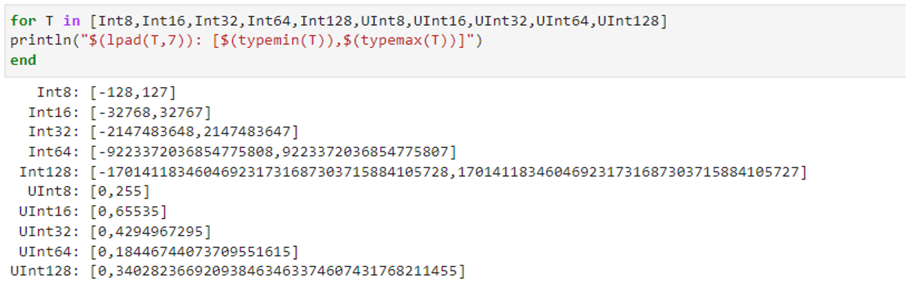

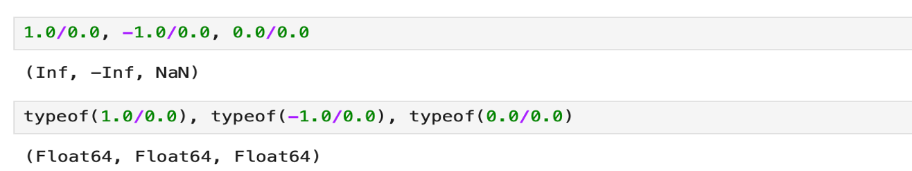

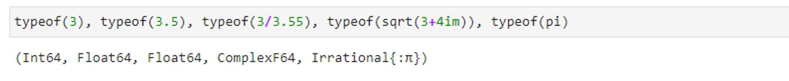

# Выполнения работы

Основы синтаксиса Julia на примерах
- В Julia преобразование типов можно реализовать или прямым указанием, например вещественное число 2.0 преобразовать в целое, а число 2 в символ или использовать обобщённый оператор преобразования типов convert().
Преобразование 1 в булевое true, 0 — в булевое false.

- Для приведения нескольких аргументов к одному типу, если это возможно, используется оператор promote().
  
- Способы определения функций
  
- Пример определения одномерных массивов (вектор-строка и вектор-столбец) и обращение к их 3-ым элементам
  
- Пример определения двумерного массива (матрицы) и обращение к его элементам.
  
- Пример выполнения операций над массивами  (aa' — транспонирование вектора).

# Выполнения работы

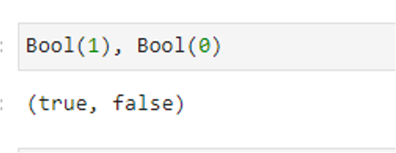

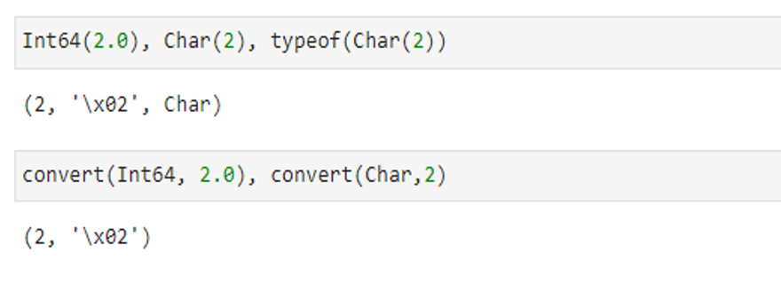

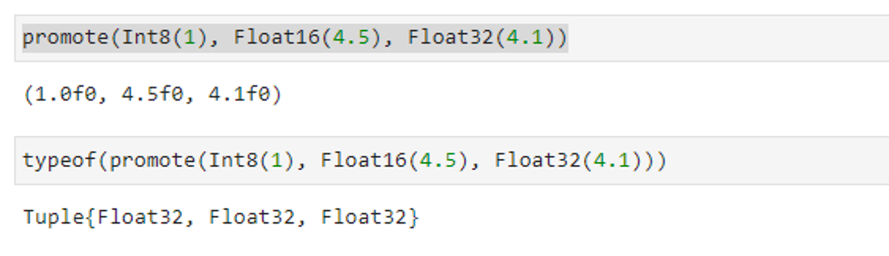

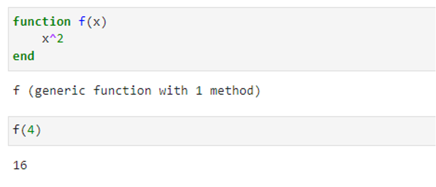

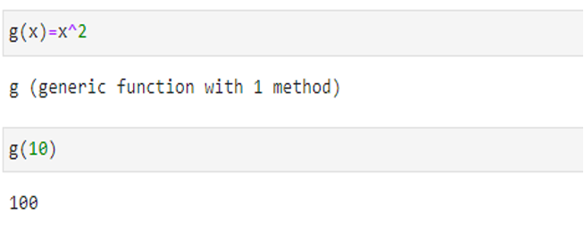

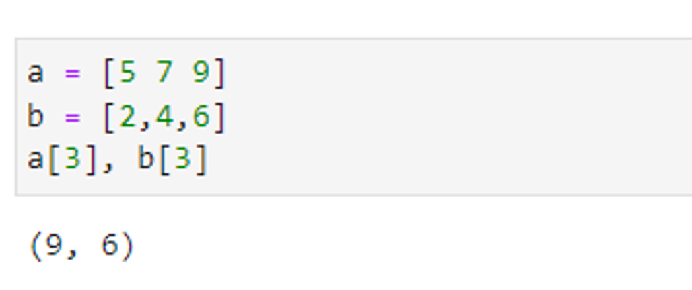

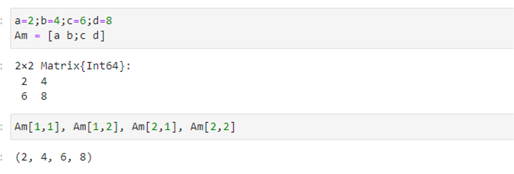

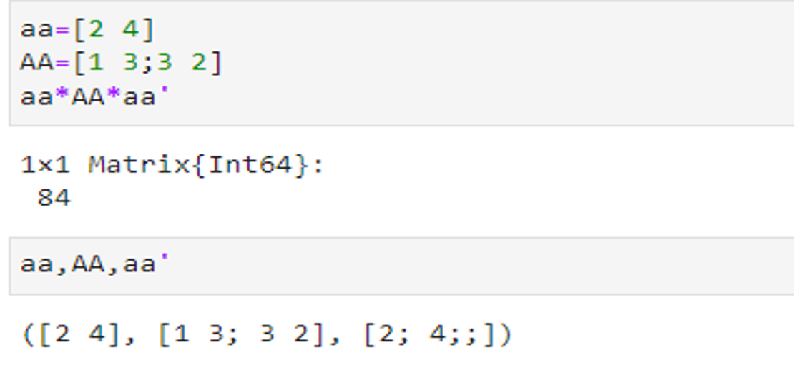

# Задания для самостоятельной работы

- Изучите документацию по основным функциям Julia для чтения / записи / вывода информации на экран: read(), readline(), readlines(), readdlm(), print(), println(), show(), write(). Приведите свои примеры их использования, поясняя особенности их применения

- Изучите документацию по функции parse(). 
Приведите свои примеры её использования, поясняя особенности её применения.

# Задания для самостоятельной работы

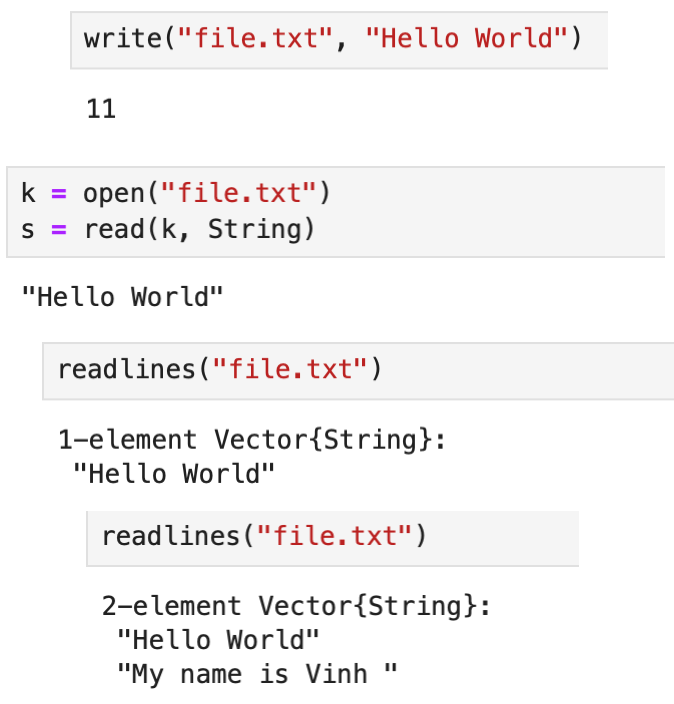

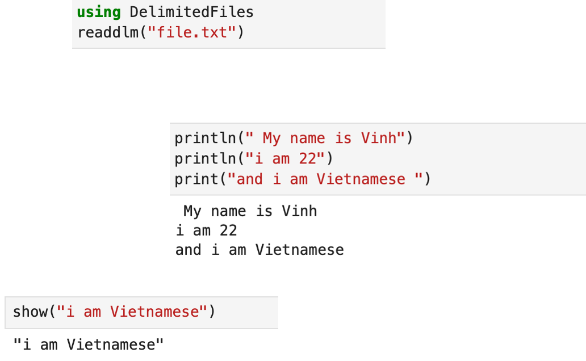

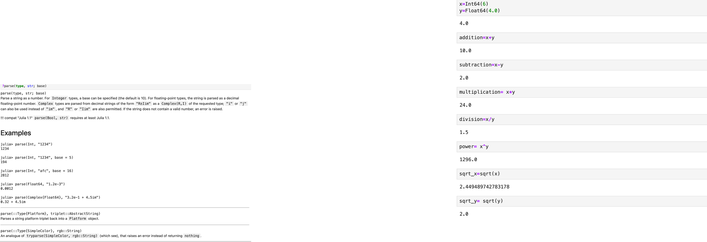

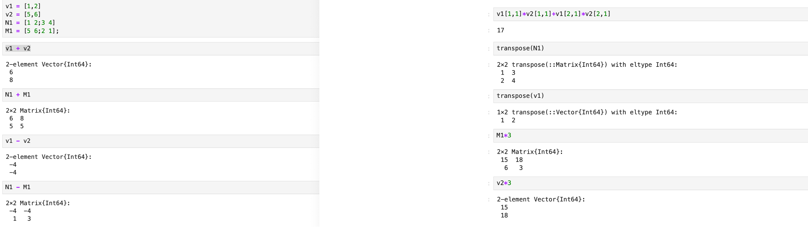

# Задания для самостоятельной работы

- Изучите синтаксис Julia для базовых математических операций с разным типом переменных: сложение, вычитание, умножение, деление, возведение в степень, извлечение корня, сравнение, логические операции. Приведите свои примеры с пояснениями по особенностям их применения. 

Приведите несколько своих примеров с пояснениями с операциями над матрицами и векторами: сложение, вычитание, скалярное произведение, транспонирование, умножение на скаляр.

# Задания для самостоятельной работы

# Вывод

В ходе данной лабораторной работы я подготовил рабочее простраство и инструментрарий для работы с языком программирования Julia, на простейших примерах познакомился с основами синтаксис Julia.

